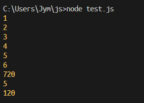

# 3주차 자바스크립트 스터디

## 1. 메모이제이션(Memoization)

메모이제이션이란 반복되는 결과를 메모리에 저장한다.

반복적으로 같은 연산을 수행할 때 연산을 하지 않고 결과를 저장해두었다

출력하는 코딩 기법을 말한다.

```jsx
function factorial(n) {
	if (Number.isInteger(n) && n > 0) {
	  if (!(n in factorial)) {
		factorial[n] = n * factorial(n - 1);
	  }
	  console.log(n);
	  return factorial[n];
	} else {
	  return '잘못된 숫자가 입력되었습니다.';
	}
  }
  
  factorial[1] = 1; // 캐시를 초기화합니다.
  console.log(factorial(6)); // => 720
  console.log(factorial(5)); // => 120 / 이 값은 이미 캐시에 존재합니다.

```

예제코드를 나름 분석하려고 로그를 몇개 찍어보았다.



캐시 데이터는 일반적으로 연산결과를 저장하는 함수의 배열에 저장되었다.

그리고 6을 연산한 뒤 바로 5를 연산시켜봤더니 기존의 연산결과가 이미 저장되어 있어 바로 결과값을 출력했다.

이 결과의 비밀은 if문에서 `n in factorial` 로 factorial 연산결과가 이미 있는지 검사하고, return을 캐시데이터로 하는 부분.

그리고 각 재귀 연산이 될때마다 결과 값을 함수 배열에 저장하는 구문이 존재하기에 이런 결과가 가능한 것이다.

확실히 불필요한 연산을 줄일 수 있어 프로그램 속도 면에서 빠를 것 같다. 메모리 측면은…음 몰루?

## 2. 클로저-중첩-함수

클로저…아마 이 과제에서 가장 어려운 부분일 것이다.

먼저 클로저란 무엇인가? 에 대한 정의를 찾아보았다.

> “A closure is the combination of a function and the lexical environment within which that function was declared.”
> 
> 
> 클로저는 함수와 그 함수가 선언됐을 때의 렉시컬 환경(Lexical environment)과의 조합이다.
> 

~~뭔소리여~~너무 어려운 설명에 어이가 없어서 예제부터 찾아보기로 했다.

```jsx
function outerFunc() {
  let x = 10;
  const innerFunc = function () { console.log(x); };
  return innerFunc;
}

const inner = outerFunc();
inner(); // 10
```

클로저의 가장 간단한 예제다.

이 예제의 설명을 읽어보니 클로저가 조금 이해 되는 것 같았다.

inner 변수에 outerFunc를 호출하고 저장했다. 이 때 outerFunc는 innerFunc을 리턴하고 생을 마감했다.

즉 outerFunc는 실행된 이후 종료처리가 되었기에 outerFunc의 x값에 접근하는 것이 불가능하다.

하지만 위의 코드를 실행결과는 10이 나온다.

왜일까? 라이프사이클이 이미 종료된 함수의 값이 왜 출력되는 걸까?

outerFunc은 이미 생을 마감했지만 innerFunc은 살아서 유지되고 있었다.

<aside>
🎯 innerFunc는 outerFunc의 내부에 있기에 스코프에 의해 x에 접근할 수 있었다.

</aside>

> “A closure is the combination of a function and the lexical environment within which that function was declared.”
> 
> 
> 클로저는 함수와 그 함수가 선언됐을 때의 렉시컬 환경(Lexical environment)과의 조합이다.
> 

다시 정의로 돌아가보았다. 그리고 이 내용을 다시 읽었을 때 비로소 이해가 되었다.

클로저는 리턴된 innerFunc가 자신이 선언된 순간의 **렉시컬 환경인 스코프를 기억하고 그 스코프에 접근할 수 있는 함수**라는 뜻이었다.

**❗착각하지 말아야 할 점은 단순 함수를 리턴하는 함수를 클로저라고 하지는 않는다!!**

### 근데 이건 왜 쓰는거지?

조금 이해가 가지 않았다. 어찌되었든 자신이 선언되었던 그 환경을 기억한다면 메모리를 사용한다는 뜻이다.

게다가 그냥 함수를 선언해서 그때 그때 호출하면 되는 일 아닌가???

**1️⃣ 상태유지**

클로저 함수는 외부 함수가 사망상태여도 외부 함수의 변수를 사용할 수 있기 때문에, 특정 데이터를 그 안에 두고 계속 관리할 수 있다.

```jsx
//클로저를 사용하지 않은 경우
const counter = () =>{
	let count = 0;
	return ++count;
}
let a = counter();
console.log(a);//1
console.log(a);//1

const counter = () =>{
	let count = 0;
	return function(){
		count++;
		console.log(count);
	}
}
let a = counter();
a();//1
a();//2
```

<aside>
💡 리액트에선 이걸 따로 지원한다 useState()

</aside>

**2️⃣ 전역 변수의 남용 방지**

전역 변수가 남발되면 당연히 프로그램에서 사용하는 변수 명이 다양해지고, 프로그램이 복잡해진다.

똑같이 count라는 이름을 사용하더라도 a의 count와 b의 count를 a_count, b_count 같은 식의 선언을 하지 않아도 된다.

3️⃣ ****캡슐화****

자바스크립트는 기존의 언어들과 달리 private같은 접근제어자가 없다.

접근제어자가 없다는 건 이런 뜻이다.

```jsx
function Hello(name) {
	this._name = name; //생성자 함수로 _name에 name값 할당
  }

  Hello.prototype.say = function() {
		console.log('Hello, ' + this._name);
  }

let a = new Hello('영민');
a.say(); //Hello, 영민
a._name = '용성';
a.say(); // Hello, 용성
```

a라는 객체를 만들고 a객체의 멤버 변수 `_name`에 접근하는 것을 막을 방법이없다.

이것을 클로저를 사용하면 간단하게 해결할 수 있다.

```jsx
function Hello(name) {
	let _name = name;
	return {
	  say: function() {
			console.log('Hello, ' + _name);
	  },
	};
}
let a = new Hello('영민');
a.say(); // Hello, 영민
a._name = '용성';
a.say(); // Hello, 영민
```

a의 _name변수에 더이상 접근이 불가능해져 수정이 불가하다.

## 3. 프로토타입

자바스크립트의 클래스라는 개념이 사실 있긴하지만(ES5 추가) 문법적인 양념일뿐이다.

여전히 프로토타입 기반 언어라는 것은 다르지 않기에 아는 것이 중요하다.

### 프로토타입은 객체의 원형이다.

```jsx
const arr = [3, 2, 1];

console.log(arr.sort());
//[1, 2, 3]
console.log(arr);
//[1, 2, 3]
```

배열에서 `sort` 메소드를 사용할 수 있는 이유를 간단히 생각해보면 프로토타입이 무엇인지 감이 잡힌다.

배열이라는 자료형은 sort, filter등의 메소드를 사용할 수 있다.

왜 이게 사용이 가능할까? 상속이라는 개념 덕분이다.


부모가 가진 것을 넘겨주는 그 상속 맞다.

배열 선언은 배열 리터럴로 하긴했지만 실제로 코드 내부적으로는 new Array()같은 생성자 함수로 생성이 된 것이다.

이렇게 생성된 배열은 Array라는 객체의 메소드들을 상속받게 된 것이다.

### prototype 객체

프로토타입 객체는 생성자 함수로 생성된 각각의 객체에 공유 프로퍼티를 제공하기 위해 사용한다.

배열 객체가 가지고 있는 프로토타입 객체는 프로퍼티들을 정의하고 있다.

**sort, filter, concat, fill, find, sort, push, pop등이 이에 해당한다!**

## 4. 화살표함수

화살표함수는 ES6에서 새로 추가되었다.

차이는 다음과 같다.

```jsx
function fun(){
	console.log("hi");
}
const arrowFun = () => {
	console.log("hi");
}
```

### 1. this

자바스크립트의 모든 함수는 함수 내부에 this라는 객체가 생긴다.

이렇게 생긴 this는 일반 함수는 메소드를 소유한 객체를 가리키게된다.

즉 일반적으로 전역(Global)을 가리키게되고, 객체 안의 메소드라면 객체를 가리킨다.

하지만 **화살표함수**는 자체적으로 가리키는 this가 없다.

```jsx
let myObj = { 
    age: 30,
    arrowFunc:() => { 
        console.log(this.age);
				//this가 없으므로 myObj의 this를 가져오는데 myObj를 소유한 객체는 window객체
    },
    regularFunc(){ 
        console.log(this.age); 
    } 
};
myObj.arrowFunc(); //undefined
myObj.regularFunc(); //30
```

이 예제를 한번 실행해보자

원래대로라면 arrowFunc를 소유한 객체인 myObj의 age값을 가져와야한다.

하지만 결과는 undefined다. 왜 그럴까?

화살표 함수는 자체적으로 가리키는 this가 없기에 상위 스코프의 this를 가져와서 사용하게 된다.

그렇다는건 myObj의 상위 스코프를 가져오는 것이고, myObj의 상위 객체는 Window 객체라서 전역적으로 선언된 age를 찾게되는 것이다.

### 2. 생성자 함수로 사용 가능 여부

단점이라면 단점인 내용

```jsx
function fun() {
  this.num = 1234;
}
const arrFun = () => {
  this.num = 1234;
};

const funA = new fun();
console.log(funA.num); // 1234

const funB = new arrFun(); // Error
```

이건 위의 프로토타입에서의 내용의 연계인데.

결론적으로 prototype 프로퍼티 중 생성자 함수를 가지고 있지 않아서 불가능하다.

### 화살표함수 왜 쓰는걸까?

일반함수보다 기능이 제한되는데 왜 쓸까? (생성자, 상속 불가, this, super, argument 등 바인딩 불가)

사용이 불가능한 경우를 다음 세가지가 있다.

1. 객체의 메소드로 사용 금지
2. 프로토타입 메소드 정의시 사용금
3. 이벤트 핸들러 함수로 사용금지

> 출처: [https://developer-talk.tistory.com/821](https://developer-talk.tistory.com/821)
> 

대부분 this 자체적으로 없는 문제 때문이다. 그런데 왜 사용하는걸까?

물론 간결하다는 이유가 있지만, 또 다른 이유가 있다.

그 이유또한 아이러니하게도 this때문이다.

```jsx
function start(newFunc){
	myVar = 'test';
	newFunc();
}

let obj = {
	myVar: 'foo',
	
	myFunc: function() { 
	  console.log(this.myVar)
	  start(function(){
		console.log(this.myVar);
	  })
	}
  }
obj.myFunc()
//foo
//test
```

다음과 같이 콜백함수에 this값을 포함시켜 보낼 경우에 문제가 생기는데

콜백함수를 호출하는 함수(start)의 this를 참조하게 된다.

그래서 원래 결과인 foo foo가 나오지않고 foo test가 출력되어 버린다.

이 문제를 화살표 함수로 해결할 수 있다.

```jsx
function start(newFunc){
	myVar = 'test';
	newFunc();
}

let obj = {
	myVar: 'foo',
	
	myFunc: function() { 
	  console.log(this.myVar)
	  start(() => {
		console.log(this.myVar);
	  })
	}
  }
obj.myFunc()
//foo
//foo
```

start함수의 상위 객체(호출된 시점)의 this를 가져오게 되어 결과가 올바르게 출력된다.

## QUIZ

### 1. 위아래 위위아래 위아래 위위아래

```jsx
// exid.js
const exid = {
    count: 40,
    up(){
      this.count++;
    },
    down(){
      this.count--;
    },
    showCount(){
      console.log(this.count);
    },
  };

exid.up();
exid.down();
exid.up();
exid.up();
exid.down();
exid.up();
exid.down();
exid.up();
exid.up();
exid.down();
exid.showCount();
```

```jsx
const exidMethodChaining = {
    count: 40,
    up(){
      this.count++;
      return this;
    },
    down(){
      this.count--;
      return this;
    },
    showCount(){ 
      console.log(this.count);
      return this;
    },
  };
  
exidMethodChaining.up().down().up().up().down().up().down().up().up().down().showCount()
```

메서드체이닝이 가능하도록 메서드를 작성하려면 해당 객체를 리턴해주면 된다.

그러면 메서드를 실행하면서 자기자신을 다시 로드해 메서드를 실행시킬 수 있다.

### 2. 배열로 만드는 스택

```jsx
const stackCreate = () => ({
	arr: []
  });

const stackEmpty = stack => {
	let count = 0;
	for (element in stack.arr){
		count++;
	}
	return count === 0;
};

const stackPush = (stack, data) => stack.arr = [data, ...stack.arr];

const stackPeek = stack => {
	if (!stackEmpty(stack))
		return stack.arr[0];
}

const stackPop = stack => {
	if (stackEmpty(stack))
		return undefined;
	let count = 0;
	const newArr = [];
	for (element in stack.arr){
		count++;
	}
	for (let i = 1; i < count; i++){
		newArr[i - 1] = stack.arr[i];
	}
	stack.arr = newArr;
}

newStack = stackCreate();

stackPush(newStack, 10);
console.log(newStack);
stackPush(newStack, 20);
console.log(newStack);
stackPush(newStack, 30);
console.log(newStack);
stackPop(newStack);
console.log(newStack);

console.log(stackPeek(newStack));
```

length를 써도 되지만 예전부터 라이브러리 하나없이 문법만으로 풀어본 경험이 있어서 그냥 좀 무식하게 짜봤다.

니들은 이런거 하지마라…